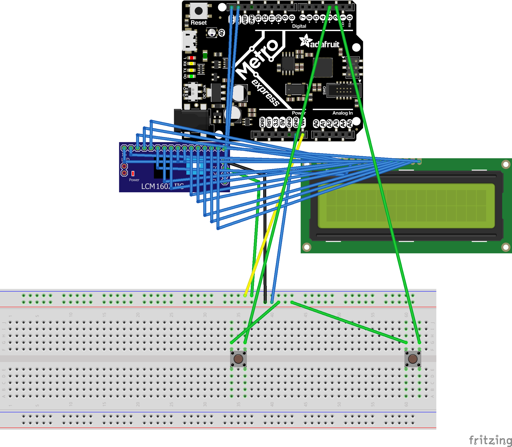

# CircuitPython
My CircuitPython assignments
## Hello Circuit Python
### Description
This was the first of many circuit python assignments.The main objective of this assignment was to make an LED and then make it fade in and out.

### What I have learned
-Circuit python is easier that arduino.

-This is just similar to the first assignment last year.

-Imports are necessary to every assignment.

### Wiring Diagram

## Circuit Python Servo

### Description
This assignment required us to use duty cycle along with PWM to Turn a servo while using capacitive touch.

### Lesson learned
- How to use duty cycle
- How to use capacitive touch
- What PWM does
- Duty cycle isn't as complicated as it looks

### Wiring Diagram

## Circuit Python LCD

### Description
The point of this assignment was to use to buttons: one to change it from going up to down and vice versa, another to make the counter go up or down by one. 

### Lessons learned

- I learned that you should work one at a time and not try and do everything at once.
- I learned that switches are easier than buttons.
- How to make it only go up by one for every press.

### Wiring diagram

## Circuit Python Photoinerrupters

### Description
In this assignment we were to use a photo interrupter to count the number of times it was passed through and print a message that says it. 

### lessons learned
- My prior knowledge of making it only count once came in handy because i had to do the same thing on this assignment.
- Learned how to pull up and down.

### wiring diagram
  

 ## Circuit Python Distance sensor

 ### Description
 The objective of this assignment was to use an HCSR04 to change the color on our Metro. This assignment was tricky becasue it required use to use special statments to change the color based on distance.

 ### Lessons learned
 - It isn't as hard as it seems.
 - Using duty cycle is helpful.
- When you get an error about all the timers being used try to switch your pins.

### Wiring Diagram

## Hello VS code

### Description
The purpose of this assignment was to get us used to using VS code. It was a pretty simple assignment

### Lessons learned
- That with VS code you can automatically ppush things to git hub.
- Its a little more complicated than MU

## FancyLED

### Description
The objective of this assignment was to make 5 LEDs blink, chase, sparkle, and alternate. This required us to make a class.

### Lesson learned
- I learned that breaking up the code makes it much more managable.
- I learned that you can use code to ignore errors.
- I learned that you can make LEDs do multiple things at the same time.

### Wiring diagram

