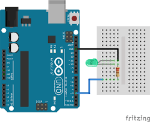
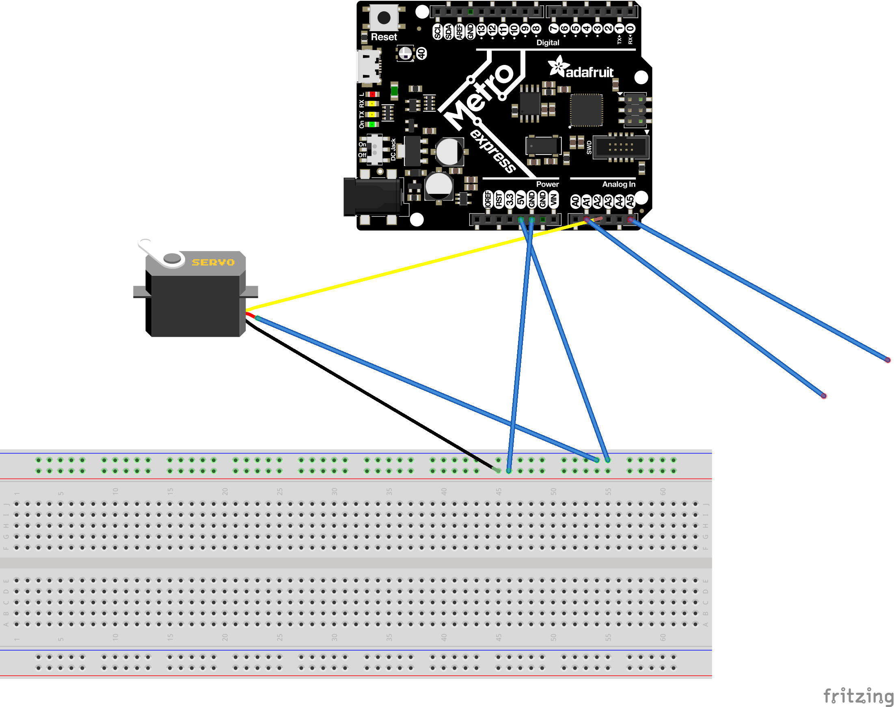

# CircuitPython
My CircuitPython assignments
## Hello Circuit Python
### Description
This was the first of many circuit python assignments.The main objective of this assignment was to make an LED and then make it fade in and out.
### Commented code
import time
import board
import pulseio

led = pulseio.PWMOut(board.D13, frequency=5000, duty_cycle=0)

while True:
    for i in range(100):
        # PWM LED up and down
        if i < 50: #says if I < 50 it goes brighter "
            led.duty_cycle = int(i * 2 * 65535 / 100)  # Up
        else:
            led.duty_cycle = 65535 - int((i - 50) * 2 * 65535 / 100)  # Down
        time.sleep(0.03) #This makes it go down
### What I have learned
-Circuit python is easier that arduino.

-This is just similar to the first assignment last year.

-Imports are necessary to every assignment.

### Wiring Diagram

## Circuit Python Servo

### Description
This assignment required us to use duty cycle along with PWM to Turn a servo while using capacitive touch.
### Commented code

import board
import time
import touchio
import pulseio
from adafruit_motor import servo

touch_A1 = touchio.TouchIn(board.A1) # sets up which pins are touch pins
touch_A5 = touchio.TouchIn(board.A5)
pwm = pulseio.PWMOut(board.A2, duty_cycle=2 ** 15, frequency=50)

my_servo = servo.Servo(pwm)
angle = 6
while True:
    if touch_A1.value: #when A1 is touched "a1 been touched" is printed on serial monitor
        print("A1 been touched")
        angle += 1

    if touch_A5.value: #when A5 is touched "a5 been touched" is printed on the serial monitor
        print("A5 been touched")
        angle -= 1
    if angle > 180:
        angle = 180
    if angle < 0:
        angle = 0
    my_servo.angle = angle
    
### Lesson learned
- How to use duty cycle
- How to use capacitive touch
- What PWM does
- Duty cycle isn't as complicated as it looks

### Wiring Diagram

## Circuit Python LCD

### Description
The point of this assignment was to use to buttons: one to change it from going up to down and vice versa, another to make the counter go up or down by one. 

### Code
import board
import time
from digitalio import DigitalInOut, Direction, Pull
from lcd.lcd import LCD
from lcd.i2c_pcf8574_interface import I2CPCF8574Interface
from lcd.lcd import CursorMode

button = DigitalInOut(board.D2)
button.direction = Direction.INPUT
button.pull = Pull.DOWN
switch = DigitalInOut(board.D3)
switch.direction = Direction.INPUT
switch.pull = Pull.DOWN

clicks = 0
clicks2 = 1
lcd = LCD(I2CPCF8574Interface(0x27), num_rows=2, num_cols=16)
#oldButton = False

while True:
     if not button.value:# and oldButton:
        lcd.set_cursor_pos(0,0)
        lcd.print("Switch")
        lcd.set_cursor_pos(1,0)
        lcd.print("presses")

        if switch.value:
            clicks2 =-1 # Make it go down 

            lcd.set_cursor_pos(0,7)
            lcd.print(" Down ")
            lcd.print("  ")
            lcd.set_cursor_pos(0,7)
        if switch.value and clicks2 == -1: # make it go up
            clicks2 = 1
            lcd.set_cursor_pos(0,7)
            lcd.print(" Up ")
            lcd.print("  ")
            lcd.set_cursor_pos(0,7)
        if button.value: #and oldButton:

            lcd.set_cursor_pos(1,8) #prints number
            clicks += clicks2
            lcd.print(str(clicks))
            lcd.print("  ")
            lcd.set_cursor_pos(1,8)
     #oldButton = button.value
### Lessons learned

- I learned that you should work one at a time and not try and do everything at once.
- I learned that switches are easier than buttons.
- How to make it only go up by one for every press.

### Wiring diagram
*insert image*

## Circuit Python Photoinerrupters

### Description
In this assignment we were to use a photo interrupter to count the number of times it was passed through and print a message that says it. 
### Code
import board
import time
from digitalio import DigitalInOut, Direction, Pull

counter = 0
interrups = 0
lasttime = 0
photo = DigitalInOut(board.D13)
photo.direction = Direction.INPUT
photo.pull = Pull.UP
initial = time.monotonic()
print("working")
while True:
    #print(photo.value)
    now = time.monotonic() # sets up the time
    if time.monotonic() % 4 == 0:
        print("the number of interrupts is ",counter )#prints out phrase
    if photo.value and interrups==0 :
         interrups=1
         initial = now
         counter = counter + 1 # adds the interrups

    elif not photo.value:

        interrups = 0
### lessons learned
- My prior knowledge of making it only count once came in handy because i had to do the same thing on this assignment.
- Learned how to pull up and down.

### wiring diagram
 *insert Image* 

 ## Circuit Python Distance sensor

 ### Description
 The objective of this assignment was to use an HCSR04 to change the color on our Metro. This assignment was tricky becasue it required use to use special statments to change the color based on distance.
### Code
import time
import neopixel
import board
from adafruit_hcsr04 import HCSR04
trig = board.D2
echo = board.D3
sonar = HCSR04(trig, echo)
pixel_pin = board.NEOPIXEL
num_pixels = 1
pixels = neopixel.NeoPixel(pixel_pin, num_pixels, brightness=0.3)

RED = (255, 0, 0) #sets up the colors
PINK = (255, 0, 180)
PURPLE = (180, 0, 255)
BLUE = (0, 0, 255)
CYAN = (0, 255, 255)
GREEN = (0, 255, 0)

while True:
    try:
        distance = sonar.distance
        print((distance))

        if distance > 0 and distance <= 7: # sets up the distance and thier coresponding colors
            pixels.fill(RED)
            pixels.show()
        if distance > 7 and distance <= 15:
            pixels.fill(PURPLE)
            pixels.show()
        if distance > 15 and distance <= 23:
            pixels.fill(BLUE)
            pixels.show()
        if distance > 23 and distance <= 29:
            pixels.fill(CYAN)
            pixels.show()
        if distance > 29 and distance <= 35:
            pixels.fill(GREEN)
            pixels.show()
    except RuntimeError:
        print("Retrying!")
        pass
        time.sleep(.2)
 ### Lessons learned
 - Writing the statement to control the color was very hard
 - It is harder to hard code though.

 ### Wiring Diagram
 *insert image*

 ## Classes, Objects, and Modules

 ### Description
 This assignment introduced us to the concept of making our own modules. This assignment had us make a module for 2 RGB LEDs.
### code
import board 
import time
import pulseio

class RGB:
    kind = "color"

    def__init__(self, r, g, b):
        self.r1 = pulseio.PWMOut(r1, frequency=1000, duty_cycle=0)
        self.g1 = pulseio.PWMOut(g1, frequency=1000, duty_cycle=0)
        self.b1 = pulseio.PWMOut(b1, frequency=1000, duty_cycle=0)

        def red(self):
            self.r1.duty_cycle = 0
            self.g1.duty_cycle = 2**16-1
            self.b1.duty_cycle = 2**16-1  # uses duty cycle to determine the color
        def green(self):
            self.r1.duty_cycle = 2**16-1 #adds red ass a color
            self.g1.duty_cycle = 0
            self.b1.duty_cycle = 2**16-1
        def yellow(self):
            self.r1.duty_cycle = 0
            self.g1.duty_cycle = 0
            self.b1.duty_cycle = 2**16-1
        def blue(self):
            self.r1.duty_cycle = 2**16-1
            self.g1.duty_cycle = 2**16-1
            self.b1.duty_cycle = 0
        def cyan(self):
            self.r1.duty_cycle = 2**16-1
            self.g1.duty_cycle = 0
            self.b1.duty_cycle = 0
        def magenta(self):
            self.r1.duty_cycle = 0
            self.g1.duty_cycle = 2**16-1
            self.b1.duty_cycle = 0

 ### Lessons learned
 - It isn't as hard as it seems.
 - Using duty cycle is helpful.
- When you get an error about all the timers being used try to switch your pins.

### Wiring Diagram
*insert image*

## Hello VS code

### Description
The purpose of this assignment was to get us used to using VS code. It was a pretty simple assignment

### Lessons learned
- That with VS code you can automatically ppush things to git hub.
- Its a little more complicated than MU

### Code
import time  
 while True:
     print("hello")
     time.sleep(.1)
